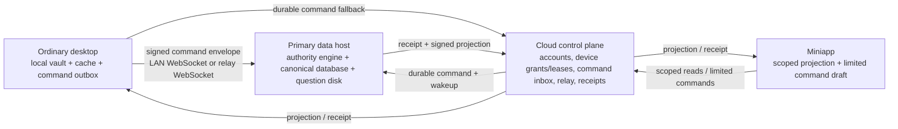

# Authority Architecture Cutover

## Status and decision

This document refines and supersedes the unfinished portions of
`2026-07-27-runtime-architecture.md`. The approved direction remains a
three-plane system. The implementation must be a replacement with a bounded,
rehearsed cutover, not another compatibility layer on the legacy desktop-sync
and desktop-session routes.

Three approaches were considered:

1. Continue adapting the existing direct-sync, relay-task, and host-session
   flows. Rejected: those paths each own part of authorization and command
   execution, so every repair creates another inconsistent state.
2. Big-bang replacement of the authority database and every client. Rejected:
   it risks business data, prevents migration rehearsal, and offers no safe
   rollback point.
3. Build the new authority protocol in parallel, migrate with a copy-only
   rehearsal, cut clients and host to it atomically, then remove legacy code.
   Selected: it creates one observable contract while preserving the local
   data host as the sole business authority.

No release, cloud deployment, OSS publish, or version bump is permitted until
the cutover gates in this document pass.

## The problem being replaced

The current tree already contains useful pieces of the new design, including
authority command/receipt services, access scopes, a host worker, and WebSocket
wakeup. It also still has three competing implementations:

- LAN direct sync posts raw record changes to `/api/sync`.
- Cloud relay serializes desktop-sync requests and gives WebSocket and HTTP
  polling separate completion semantics.
- Desktop identity exchanges a challenge through a relay-host session path;
  its cloud transaction marks the device authorization active before the
  desktop has durably sealed the local credential vault.

The last item makes the reported identity failure structurally possible: a
server device is active while the local desktop remains registration-pending.
Retrying then encounters a state transition that cannot be safely repeated.
This must be removed, not hidden behind a generic UI error.

## Target topology



### 1. Cloud control plane

The cloud owns account registration, device-grant lifecycle, renewable leases,
host discovery, opaque durable command forwarding, signed receipts, and
host-published read projections. It never becomes the authority for courses,
finance, schedules, question-bank records, or the question disk.

Cloud records are control records only:

- `accounts(user_id, phone, status)`
- `device_grants(device_id, user_id, public_key, host_generation, status,
  grant_version, approved_by)`
- `device_activation_grants(activation_id, device_id, status, expires_at,
  grant_version)`
- `device_leases(lease_id, device_id, user_id, grant_version, expires_at,
  revoked_at)`
- `role_grant_mirrors` and `role_application_mirrors`, signed and published by
  the primary host
- `host_commands`, claims, and immutable `host_receipts`
- encrypted or opaque scoped projections with their source authority epoch

### 2. Primary-host authority plane

The designated primary host is the only business writer and owns the canonical
database, role grants, teacher/student profile bindings, conflict decisions,
exports, and question-disk writes. A host worker runs independently of Electron
renderer state. It polls durable commands, and WebSocket merely calls `wake()`
to reduce latency. Therefore a dropped WebSocket cannot strand a command.

The host accepts a command only when all of these are true:

- authority id and active host epoch match;
- device grant and lease are active and version-current;
- user has selected an active role grant at this authority;
- the command type/version is allowed by the host-side scope;
- `(user_id, device_id, idempotency_key)` has no conflicting payload hash.

One immediate transaction executes the business mutation, writes the command
ledger row and a hashed receipt, then publishes only the permitted projection.
The same idempotency key always returns the existing receipt and never repeats
the domain write.

### 3. Client plane

Ordinary desktop uses one Electron bridge facade for identity, lease refresh,
projection reads, outbox submission, and receipt acknowledgement. The renderer
must not choose between direct `fetch`, main-process requests, or a special
host-session exchange for the same operation. The facade persists an encrypted
local vault and a typed command outbox. It may edit locally offline, but it
must preview and obtain the user's explicit confirmation before submitting a
command to the host.

The miniapp is a client plane too: registration uses manual phone entry and
creates a visitor account. It can request teacher/student role assignment and
submit only its allowed limited commands. Future automatic phone retrieval is
kept isolated behind an adapter and is not invoked by the new flow.

## Identity and device activation protocol

`user_id` is immutable and unique. Roles are additive grants; `teacher_id` and
`student_id` are optional business-profile bindings. A visitor has no grant.
Teacher/student applications require super-administrator review at the data
host. An administrator grant is never self-service. Revoking a role never
deletes its business profile.

Device registration is a two-phase durable protocol:

1. The desktop creates a device key locally, starts an identity challenge, and
   completes the user verification. The host approves or rejects the pending
   device.
2. `exchange` verifies the challenge and device signature, creates an
   expiring `activation_pending` record, and returns an activation package. It
   does **not** activate the device.
3. The Electron main process validates the complete package, seals the vault,
   then signs an activation receipt with the device key.
4. `finalize` consumes that receipt and changes the device grant to `active`.
   It issues/renews the cloud lease in the same control transaction.
5. If the desktop crashes after sealing but before finalization, `resume`
   replays the exact activation package and repeats the receipt safely. If it
   crashes before sealing, expiry leaves no active device.

The initial login and later local password unlock do not require a reachable
host. A valid local vault plus an unrevoked lease can open the client in its
allowed read state. Business writes wait for reachable authority transport.

## One command protocol, two transport adapters

LAN and public relay must be transport adapters, not two business protocols.
Both deliver exactly this versioned envelope:

```json
{
  "protocol": "gewu.authority-command.v1",
  "commandId": "uuid",
  "idempotencyKey": "uuid",
  "authorityId": "authority id",
  "hostEpochId": "active epoch",
  "actor": { "userId": "user", "deviceId": "device", "role": "teacher" },
  "lease": { "id": "lease", "grantVersion": 1 },
  "type": "schedule.update.v1",
  "payload": {},
  "payloadHash": "sha256",
  "createdAt": "ISO-8601"
}
```

- `LanWebSocketTransport` sends the envelope directly to the host after a
  positive host capability check. The host returns the standard receipt.
- `RelayWebSocketTransport` forwards the same opaque envelope through cloud
  to the host. If the socket is unavailable, `DurableRelayTransport` stores
  that same envelope in the cloud command inbox; host polling claims it and
  writes the same receipt.
- Transport selection is ordered LAN, relay WebSocket, durable relay. The
  result is the transport used, never a different mutation shape.
- The host owns conflict resolution. Clients never replay raw database rows or
  apply an untrusted remote mutation.

## Authorization and projection rules

All authorization is enforced at the host before projection or command
execution; UI filtering is not a security boundary.

- Visitor: own empty/account data only and at most ten sanitized question
  previews; no other bound business data.
- Student: only the user's bound timetable and tuition. Never peer details,
  course roster, lesson-pay, or teacher compensation.
- Teacher: only bound-course details, tuition, and lesson-pay; finance filters
  are restricted to those courses.
- Admin: authority-wide data and filters.
- Super admin: admin scope plus role-application review and role grants.
- Personal assets use `asset_accounts(user_id, account_id, type, provider,
  classification, status)`. Each account belongs to one user. Manual creation
  and import-time account discovery create a classification proposal, never
  expose another user's financial data or full payment-card numbers.

## Migration and cutover

Migration is additive and copy-first:

1. Record a backup fingerprint and create a disposable copy of the authority
   database. Do not run a rehearsal in place.
2. Add the new control, activation, ledger, receipt, projection, role-grant,
   profile-binding, and asset-account tables. Add a migration ledger.
3. Seed auditable role grants from legacy fields without granting privilege
   from a client request. Legacy scalar roles and old pairing records become
   read-only migration inputs.
4. Run scope parity and command-replay tests on the copy. Any ambiguity,
   duplicate binding, stale active host epoch, or mismatched role fails the
   rehearsal rather than being guessed.
5. Deploy cloud support and host support with the new protocol enabled but no
   old client cutover. The host is the only command executor.
6. Cut ordinary desktop and miniapp to the one bridge/client facade. New
   registrations use two-phase activation only. Existing valid devices migrate
   through activation receipts; invalid or incomplete legacy records require
   a fresh user verification.
7. Run the isolated two-packaged-desktop matrix. Only after it passes, reject
   old direct-sync, old desktop-session relay, long-poll business paths, and
   single-user pairing routes with a terminal migration error. Delete their
   implementations and tests rather than retaining permanent compatibility.

Rollback is code/feature-gate rollback only. It retains new records, receipts,
audits, and the migration ledger; it never resurrects a revoked credential or
silently re-enables a legacy authorization path.

## Required verification gates

1. Unit and HTTP contract tests prove no device can become active before a
   finalized local-vault receipt; finalize/resume is idempotent.
2. Migration rehearsal leaves the source fingerprint unchanged and reports
   zero scope-parity failures on its disposable copy.
3. A host worker processes a durable command with WebSocket disabled and
   returns one receipt after a retry/crash simulation.
4. Every role and combination is verified server-side for question, course,
   finance, asset, and non-disclosure behavior.
5. Two isolated packaged Electron apps perform real UI-driven binding,
   local-password completion, LAN command/receipt round trip, relay command/
   receipt round trip, bidirectional projections, restart recovery, and
   explicit offline-change confirmation. Test data and profiles are disposable.
6. The compatibility matrix (cloud, primary host, ordinary desktop, miniapp)
   is green before commit, deployment, push, and OSS update publication.
