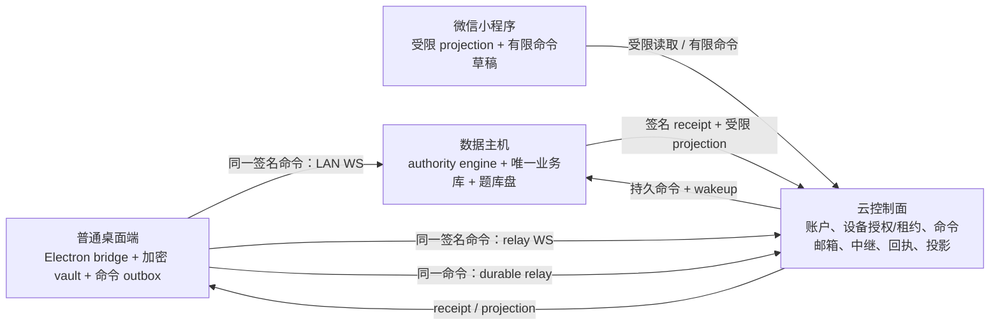

# 格物工坊：权威数据主机架构重写与真实双端验收

> **最新节点（2026-07-28，已冻结）**
>
> 当前项目**尚未完成架构重写**。工作树中的两阶段设备激活、共享 authority 协议、部分角色/投影服务、主机 worker 和隔离 Electron 脚本，只是未完成原型。旧 `/api/sync`、`desktop-session`、`oneClickSync` 与旧 cloud-relay 仍在正常运行路径中。因此，任何局部测试、构建成功或 UI 修复都不能称为“架构切换完成”。
>
> 最近的隔离双端 E2E 停在数据主机“身份与设备”页：`HOST_IDENTITY_UI_MISSING`。该运行没有完成普通端审批、LAN、中继或双向同步。本文件规定：下一会话先完成架构替换，之后以新运行时重新做真实双端验收；不得绕过该失败来修补旧链路。

## 1. 目标、范围和硬约束

### 最终结果

把格物工坊改为“**指定本地数据主机是唯一权威业务写入者**”的多端系统，并在同一台 Windows 主机上用两个独立打包 Electron 应用，完成以下真实 UI 驱动的验证：

1. 普通桌面端与数据主机端各有独立 `userData`、设备 ID、临时数据库、端口和进程，不共享真实用户 profile。
2. 普通端经真实 UI 发起绑定，数据主机在真实“身份与设备”页审批，客户端完成本机密码 vault 封存并取得 active lease。
3. 同一条签名业务命令在 LAN WebSocket、云中继 WebSocket、持久中继三种传输下，使用完全相同的授权、幂等、回执和投影语义。
4. 普通端→主机和主机→普通端各做一次隔离测试数据变更，双方 UI、命令 ledger、回执和受限 projection 均确认一致。
5. 测试绝不修改真实权威数据库、题库移动硬盘、真实设备授权、生产云数据或用户现有配置。

### 禁止事项

- 不得继续把旧 `/api/sync`、旧 `desktop-session`、旧单人配对、旧 long-poll 同步修补成最终方案。
- 云端不得成为课程、排课、题库、财务、资产或角色的权威数据库。
- 普通端、小程序和 renderer 不得直写数据主机业务库或题库盘。
- WebSocket 只能降低延迟，不能是命令唯一送达/执行方式；掉线后持久命令和主机轮询必须恢复。
- 本地 vault 未封存并签收前，设备不得被任何服务标为 active。
- 不得用路由直调、mock renderer、伪造 UI 成功或改真实数据库，替代真实双端测试。
- 切换门槛未通过前，禁止 Git push、合并 PR、版本递增、正式打包和 OSS 发布。

### 工作树与安全

- 工作树已有大量用户/OpenCode 改动；不得 `reset --hard`、`checkout --`、`clean`、批量暂存或覆盖无关文件。
- 每个修改先写可复现失败测试（RED），确认失败原因后实施最小修复（GREEN）。
- 临时 E2E 使用随机端口、临时 profile、临时 SQLite、测试账号和带唯一前缀的数据；清理前必须核对绝对路径及临时标记。
- Electron 打包后必须运行 `npm run rebuild:node` 并确认 native ABI 已恢复。

## 2. 为什么要重写

旧系统有多个竞争的“谁来授权、谁来写入、何时完成”的实现：

| 旧路径 | 结构问题 | 最终处置 |
| --- | --- | --- |
| LAN `/api/sync` 原始记录同步 | 客户端提交行级变更，客户端、主机、同步层各自解释权限和合并。 | 新协议上线后终止并删除。 |
| cloud relay `desktop-sync` 任务 | WebSocket、HTTP 轮询与任务结果有不同完成语义。 | 收敛为同一命令信封的传输 adapter；旧任务类型删除。 |
| `desktop-session` / 旧配对 | 服务端 active 与本地凭据封存不是可靠同一状态机。 | 用两阶段 activation 替代并删除。 |
| renderer direct fetch / main 特例 | 同一功能在不同 UI 状态走不同网络、授权和错误路径。 | 一个 Electron bridge facade；renderer 不自行选协议。 |

重写不是在真实数据上破坏性 big-bang：新模块并行实现 → 在权威库副本迁移、回放、比对 → 原子切客户端和主机 → 真实矩阵通过 → 删除旧正常运行路径。迁移可读取旧记录作为一次性输入；最终运行时不保留旧授权或同步 fallback。

## 3. 三平面目标架构



### 3.1 云控制面：控制记录，不是业务权威库

云端负责账户、手机验证、设备授权/撤销、14 天可续 lease、主机发现、命令邮箱、relay、不可变 receipt 及主机签名 projection。云端不直接写课程、排课、题库基础数据、财务明细或题库盘。

最小控制模型：

- `accounts(user_id, phone, status)`：稳定底层用户主体；手机号仅登录属性。
- `device_grants(device_id, user_id, public_key, host_generation, status, grant_version, approved_by)`。
- `device_activations(activation_id, device_id, package_hash, status, expires_at, finalized_at, receipt_hash)`。
- `device_leases(lease_id, device_id, user_id, grant_version, expires_at, revoked_at)`。
- `host_commands(command_id, target_host_id, envelope, payload_hash, status, claim_token, claim_until, row_version)`。
- `host_receipts(command_id, result_hash, result_payload, completed_at)`；相同命令重试必须回放同一回执。
- 主机签名的 `role_grant_mirrors`、`role_application_mirrors` 和 scope projection；每项含 `authority_id`、`host_epoch` 与 source version。

### 3.2 数据主机：唯一 authority plane

数据主机拥有权威业务库、角色授予、老师/学生档案绑定、冲突裁决、导出、题库盘写入和投影发布。它的 command worker 必须独立于 Electron renderer：renderer 关闭或 WebSocket 失联时仍定期 claim 持久命令。

主机只接受同时满足全部条件的信封：

1. `authorityId`、`hostEpochId` 分别匹配当前 authority 与活动 epoch；
2. 设备 grant active，lease 未过期/未撤销，且 `grantVersion` 当前；
3. 发起 `user_id` 在当前 authority 有匹配的活动角色 grant；
4. 命令类型/版本和 payload 通过主机 schema 与 scope policy；
5. `(user_id, device_id, idempotency_key)` 没有不同 payload hash；同 hash 回放既有 receipt；
6. 领域变更、命令 ledger、receipt、projection version 在一个主机事务内提交。

题库移动硬盘仅主机进程可写。客户端离线编辑只是受控 outbox 草稿，绝不写权威库。

### 3.3 客户端：一个 facade、一个 outbox、三种 transport

普通端由 Electron main 处理 vault、设备签名、控制面请求与网络策略；renderer 仅调用 `desktopAuthorityClient` 的受限 preload bridge。客户端有加密 typed outbox：离线编辑先保存草稿，联网后显示影响预览，用户确认前不得发送。

`transport selector` 的固定顺序为：**LAN WebSocket → relay WebSocket → durable relay**。三者传输同一 envelope，业务区别仅写入 `transportUsed`。客户端只应用已验证 receipt 授权的 projection，不能合并不受信任的远端原始行。

小程序也属于 client plane：手动填写手机号即注册 visitor；可从“我的”提交老师/学生角色申请。未来自动手机号保留独立 adapter，但当前不得调用。小程序只读为主，有限写入仅包括个人资产导入、题库选题组卷、Word/PDF 导出等任务，不能修改核心教务或题库基础数据。

## 4. 用户、角色、档案、资产与权限

### 4.1 用户主体和角色

`user_id` 是不可变的唯一身份主体；`role_grants` / `user_roles` 是可叠加标签，不是账户类型。

| 标签 | 来源 | 权限边界 |
| --- | --- | --- |
| visitor（默认） | 普通端或小程序注册 | 仅自身账户；最多十题脱敏预览；不见其他绑定数据。 |
| student | 申请，经数据主机超级管理员审核；可选绑定 student profile | 只看自己课表和学费；不看同班/一对一其他学生、课程其它明细或课时费。 |
| teacher | 申请并审核；可选绑定 teacher profile | 只看绑定课程明细、学费与课时费；费用统计只筛本人绑定课程。 |
| admin | 不可自助设置；由数据主机审核并绑定用户后产生 | authority 范围内全量数据和筛选。 |
| super_admin | 受控 bootstrap / 严格提升 | admin 权限加角色申请审核与授权。 |

`teacher_id`、`student_id` 只是可选业务档案关联；管理员不以它们为前置条件，撤销角色不删除档案。课程、财务、资产和 projection 都由 `user_id` 与 role grant 决定。

### 4.2 两阶段设备 activation

1. 客户端本地生成设备密钥、开始手机身份验证；数据主机在真实 UI 审批 pending 设备。
2. `exchange` 只创建限时 `activation_pending` package，绝不 active 设备或签发可用 lease。
3. Electron main 校验 package，以本机密码封存 vault，并用设备私钥签 activation receipt。
4. `finalize` 校验 receipt 后，在一个控制事务中将 grant 改为 active 并签发/续期 lease。
5. vault 封存后崩溃可用 `resume` 幂等重放；封存前崩溃或过期不会产生 active 设备。

已有有效 vault 与未撤销离线 lease 可进入允许的读取态；业务写必须等待可达的 authority transport。身份 UI 必须表达 pending、已审待封存、active、expired、revoked，不能一概显示“身份验证未完成”。

### 4.3 资产与 projection

`asset_accounts` 绑定 `user_id`，可有按银行拆分的储蓄卡、信用卡、支付宝、微信和自定义账户。手工创建或流水识别只能生成该用户的账户/分类建议，不能泄露完整卡号或其他用户资产。

主机签名并发布最小化 projection：visitor 仅账户与十条题目预览；student 仅本人课表/学费；teacher 仅绑定课程；admin/super_admin 全 authority，后者还能审核角色申请。UI 隐藏不是安全边界；读取 API、命令 executor、projection、导出均须在主机/服务端复核 scope。

## 5. 唯一命令/回执契约

禁止原始数据库变更。每个业务写入使用版本化信封：

```json
{
  "protocol": "gewu.authority-command.v1",
  "commandId": "uuid",
  "idempotencyKey": "uuid",
  "authorityId": "authority-id",
  "hostEpochId": "host-epoch",
  "actor": { "userId": "user-id", "deviceId": "device-id", "role": "teacher" },
  "lease": { "id": "lease-id", "grantVersion": 1 },
  "type": "schedule.update.v1",
  "payload": {},
  "payloadHash": "sha256",
  "createdAt": "ISO-8601"
}
```

receipt 必含 `commandId`、输入 hash、状态、稳定 result hash、authority/epoch、projection version、完成时间及标准错误码。相同幂等键且同 hash 只回放；相同幂等键且不同 hash 必须拒绝。命令白名单如 `schedule.update.v1`、`course.update.v1`、`asset.import.v1`、`question.export.v1`；未知类型、过期版本、scope 不足、失效 epoch 都必须产生可审计拒绝回执。

## 6. 实施与切换顺序

每一步先 RED 再 GREEN，并在“执行状态”记录实际命令与输出。文件存在不代表已接入正式运行时。

### A. 协议与 activation（已有原型，必须重验）

- 验证 `shared/authorityProtocol.js` 跨 CJS/ESM 的 stable hash、envelope、receipt。
- 验证 `deviceActivationService` 的 exchange 非 active、finalize/resume 幂等、crash recovery。
- 普通端和主机端均使用同一 activation 状态机；不改变原侧栏设计。

### B. 主机 authority command executor

- 完成 `backend/src/routes/authorityProtocol.js` 和 HTTP 契约测试。
- `authorityCommandService` 在单一事务中执行领域命令、ledger、receipt、projection version。
- `hostCommandWorker` 实现 claim/renew/expired-claim recovery；WebSocket 只能 `wake()`，不可在 socket 回调做业务变更。
- cloud relay 仅变为新协议 transport adapter；禁止再创建 legacy `desktop-sync`/`desktop-session` 业务任务。

### C. 桌面 facade 与统一 transport

- 完成 `desktopAuthorityClient.mjs`、`desktopCommandOutbox.mjs`、`authorityTransports.mjs` 与测试。
- renderer 只经 preload facade 提交、查 receipt、读 projection；移除 direct fetch/legacy session 分支。
- LAN capability/handshake、relay WS opaque forwarding、durable inbox 传同一信封，回执语义相同。
- 离线更改无用户明确确认不得送出。

### D. 用户角色、投影和小程序

- 旧 `users.role` 与旧绑定字段降为只读迁移输入；正式授权只读 `role_grants`。
- 角色申请与 super_admin 审核；admin 永不自助授予。
- user-owned asset account、导入识别候选账户与分类建议。
- 小程序手填手机号 visitor 注册、“我的”角色申请；自动手机号能力仅保留，不调用。

### E. 副本迁移、原子切换、旧路径删除

- `authorityMigrationService` 只允许权威库副本路径，必须拒绝源库路径。
- 记录源/副本 fingerprint、backup marker、migration ledger、角色/档案转换、scope parity、command replay。
- 任何重复绑定、角色歧义、epoch 不一致、scope/replay 差异均失败，不猜测修复。
- 副本演练通过后，先部署新控制面与新主机 executor，再原子切普通端/小程序到新 facade。
- 真实矩阵通过后，旧路由返回 `LEGACY_ARCHITECTURE_RETIRED` 并删除实现和旧测试；不得永久保留 compatibility fallback。

## 7. 切换、回滚和发布

### 切换前置条件

权威库已备份且可验证；演练仅在副本。新 schema/ledger/projection/version 表完整。所有新客户端写只走新 facade。云、数据主机、普通桌面、小程序的版本兼容矩阵已验证。

### 原子切换

1. 置旧写入为维护拒绝并记录 source fingerprint。
2. 运行最后一次副本演练；失败即停止切换。
3. 部署新控制面和主机 authority engine，证明 worker 在 renderer/WS 不可用时仍工作。
4. 切普通端和小程序到新 facade；有效旧设备以 activation receipt 迁移，不完整记录要求重新验证。
5. 完成真实双端矩阵后终止并删除旧 sync/session/relay 业务路径。

### 回滚

只允许代码/feature-gate 回滚；不删除 audit、receipt、migration ledger 或备份；不恢复已撤销凭据，不静默重启旧授权。真实权威库恢复只能由明确的停机维护流程执行，测试脚本绝不能自动恢复。

### 发布

所有门槛通过后才可：选择性 `git add` → commit → `git push gewu master` → `npm run dist:win` → `npm run publish:desktop-update` → `npm run rebuild:node` → 回读 OSS `latest.yml` 与安装包。此前一律不发布。

## 8. 切换后的真实双端验收矩阵

### 测试隔离

- 同一 Windows 物理主机，两个独立打包应用、独立 `userData`/device ID/临时 SQLite、随机端口。
- 使用 disposable control plane 或隔离云测试租户；不要求用户输入本机密码、阿里云/中继 token，不使用真实 profile。
- 普通端审批必须在数据主机**渲染 UI**完成。首次空白测试主机 bootstrap 可使用隔离 control-plane helper；普通端审批绝不允许用 HTTP endpoint 伪代替。
- 测试记录使用唯一 E2E 前缀；只检查临时 DB 和 profile。

| 场景 | 真实操作 | 证据 |
| --- | --- | --- |
| 主机启动 | 启动打包主机、完成隔离身份初始化/解锁 | 后端健康、worker running、主机运行态 UI。 |
| 设备绑定 | 普通端注册，主机身份页点击批准 | pending→active、主机审批 UI、vault finalize、lease active。 |
| LAN 命令 | LAN capability 成功，普通端 UI 预览后确认无害命令 | 主机 ledger/receipt、普通端 receipt、两端 projection/UI 更新，标记 LAN。 |
| relay WS | 禁用/隔离 LAN，连接云 relay | 同一 envelope/receipt、两端更新，标记 relay WebSocket。 |
| durable relay | 关闭 relay socket、延迟或重启主机 | worker 轮询 claim、恰一次执行、重试同一回执、恢复后 UI 更新。 |
| 反向同步 | 主机 UI/authority 发出第二个隔离变更 | 普通端只得到其 scope projection，无越权数据。 |
| 离线确认 | 普通端离线编辑后联网 | 预览/确认前不送；确认后一次；冲突/拒绝可见且 outbox 不丢。 |
| 角色边界 | visitor/student/teacher/admin/super_admin fixture | API、command、projection、桌面、小程序均遵守最小可见性。 |

验收必须使用真正 Electron DevTools Protocol 和原生输入操作可见 UI；不可用 mock renderer 或路由直调替代。每次失败保留错误码、最小日志、临时 profile 路径与去敏页面证据，并先添加回归测试再修复。

## 9. 当前执行状态与下一会话入口

### 2026-07-28 架构切换清单（文件存在不等于完成）

| 架构单元 | 文件存在 | 已测试（本轮 fresh 证据） | 已接入正式路径 | 旧路径已删除 |
| --- | --- | --- | --- | --- |
| 共享 authority envelope | 是：`shared/authorityProtocol.js`、`authorityHttpAuth.js` | 是：协议、稳定 hash、HTTP Ed25519 签名测试均通过 | 是（新路径）：主机 executor、LAN/relay WS、durable relay 和桌面 main facade 均传同一 envelope；旧写路径尚未删除 | 否 |
| 两阶段 activation | 是：`deviceActivationService` 及测试 | 是：服务测试及 `node backend/src/routes/desktopIdentity.http.test.js` 通过；尚无本轮打包 UI 证据 | 部分：正式 exchange 已生成 authority/epoch/canonical grant/14 天 lease，finalize 后才 active；旧 `desktop-session` 仍是正常路径 | 否 |
| authority command executor | 是：executor、projection version、registry、host runtime/processor | 是：`npm run test:authority-architecture` 的事务、回放、claim recovery 与正式运行时测试通过 | 部分：schedule/course 命令已走 lease/epoch/role scope 与单事务 projection version；LAN/relay 等价与其余白名单未闭合 | 否 |
| authority HTTP 契约 | 是：主机/云 route、inbox、authorization gate、设备签名与 HTTP 测试 | 是：正式主机 app 与 gateway 均验证签名入队、篡改拒绝、managed host claim/receipt | 是（新路径）：主机与 gateway 均挂 `/api/authority`；旧 HTTP 写入口仍待阶段 E 删除 | 否 |
| 独立 host worker | 是：`hostCommandWorker`、`authorityHostRuntime`、`authorityHostCommandProcessor` | 是：renderer/WS 无关的 polling、过期 claim recovery、稳定 receipt 回放测试通过 | 是（新 worker）：`backend/server.js` 与 Electron host runtime 已改为 authority processor；旧 cloud-relay 业务路由仍另行存在 | 否 |
| 桌面 facade / typed outbox / 三 transport | 是：facade、加密 outbox、selector、WebSocket adapter、Electron main/preload bridge | 是：未确认不发送、断线重用同 envelope、LAN→relay WS→durable 顺序、统一 receipt、签名 projection 读取与回退测试通过 | 部分：同步页/状态读取已改为 `window.desktopAuthority`，renderer 主机维护循环和旧 session relay 已终止；`browserDatabase` 仍捕获 raw-row pending changes，旧实现/路由待阶段 E 删除 | 否 |
| user/role/projection/assets | 是：additive role binding、role application、personal asset、scope projection、签名协议/store/publisher/worker | 是：visitor/student/teacher/admin 边界、可选档案绑定、资产所有者隔离、主机/云 projection HTTP、不可变失败重试和独立 worker 均有 fresh 测试 | 部分：Electron 主机已接独立 projection worker；小程序 visitor/角色申请、云控制面正式 epoch/grant/role mirror 与无需 renderer 解锁的主机签名生命周期尚未闭合 | 否 |
| copy-only migration/cutover | 否：`authorityMigrationService` 不存在 | 否 | 否 | 否 |
| 旧 raw sync / desktop-session / desktop-sync relay | 是：仍可在 `backend/src/app.js`、cloud relay、React 和 miniapp 正常路径检出 | 旧测试仍在运行，不是新架构证据 | 是：仍属正式路径，构成切换阻断 | 否 |
| 真实双端 E2E | 脚本存在 | 冻结；最近一次失败为 `HOST_IDENTITY_UI_MISSING` | 脚本仍针对旧 session/sync 链路，不能作为新运行时验收 | 不适用 |

### 2026-07-28 阶段 B 执行记录 1：authority HTTP 契约

- 修改文件：`backend/src/routes/authorityProtocol.http.test.js`、`backend/src/routes/authorityProtocol.js`、`shared/authorityProtocol.js`、`shared/authorityProtocol.test.js`、`backend/src/services/authorityCommandService.js`、`backend/src/services/authorityCommandService.test.js`。
- RED 1：`node backend/src/routes/authorityProtocol.http.test.js`，退出码 1，预期原因 `Cannot find module './authorityProtocol'`。
- GREEN 中间发现：HTTP 测试仍失败，校验器丢弃规范要求的 `payloadHash` 与 `createdAt`；未放宽测试。
- RED 2：`node shared/authorityProtocol.test.js`，退出码 1，`validated.payloadHash` 为 `undefined`。
- RED 3：`node backend/src/services/authorityCommandService.test.js`，退出码 1，tampered payload hash 未被拒绝。
- GREEN：共享协议现在要求并保留 `payloadHash`、ISO `createdAt`；executor 核对实际 payload digest。上述三个测试均退出码 0。
- 风险：当前 HTTP router 仅完成独立契约，尚未挂入正式 app，也没有 durable `host_commands` inbox；executor 回执字段、lease/epoch/scope/projection 单事务仍不完整。
- 下一步：为 `app.js` 正式路由接入和 durable inbox/receipt ownership 写 RED；保持 E2E 与发布冻结。

### 2026-07-28 阶段 B 执行记录 2：durable inbox、授权门与正式 app 接入

- 修改文件：`authorityCommandInboxService.js/.test.js`、`authorityCommandAuthorizationService.js/.test.js`、`authorityCommandInboxSchema.test.js`、`authorityProtocol.js/.http.test.js`、`authorityProtocolApp.http.test.js`、`schema.sql`、`app.js`、`package.json`。
- RED：inbox service 因模块缺失退出 1；canonical schema 因缺少 `host_commands`、`host_receipts`、`device_grants`、`device_leases` 退出 1；authorization service 因模块缺失退出 1；HTTP lease 拒绝最初错误返回 202；正式 app 路由在认证请求下为 404；CI 接线测试因 `package.json` 未收录退出 1。
- GREEN：durable inbox 对 `(user, device, idempotency)` 幂等，冲突拒绝；receipt 所有者隔离；authorization gate 校验 active epoch、grant、lease、grantVersion、role scope；`/api/authority` 已正式挂载且未认证设备不能入队。
- 验证：`npm run test:authority-architecture`，9 个脚本全部退出码 0；临时 app HTTP 测试确认 `host_commands` 写入数为 0。
- 安全：所有数据库验证均使用 `:memory:` 或 `os.tmpdir()` 下 `gewu-authority-app-http-*` 临时库；没有读取或修改真实权威业务数据。
- 风险：activation finalize 尚未在同一事务写 `device_grants`/`device_leases`；production command policy 仍 fail-closed；worker 尚未 claim 新 `host_commands`；旧 `/api/sync`、`desktop-session`、`desktop-sync` 全部仍在。
- 下一步：先用 RED 补 activation finalize 的 canonical grant/lease 原子结果，再完成新 worker claim/renew/expired recovery；继续冻结 E2E 与发布。

### 2026-07-28 阶段 B 执行记录 3：activation 与 canonical control records 原子闭合（服务层）

- RED：扩展 `deviceActivationService.test.js` 后，finalize 未写 `device_grants`，断言得到 `undefined`，退出码 1。
- GREEN：带 canonical grant/lease 的 activation package 只有在 device-key receipt 验证后，才在 finalize 同一 SQLite transaction 中激活旧授权并写 active grant/lease；exchange 阶段两表行数均为 0；重复 finalize 仍幂等。
- 兼容回归：`node backend/src/routes/desktopIdentity.http.test.js` 退出码 0。旧 route 生成的 activation package 尚不含 canonical control records，因此新 `/api/authority` 对旧激活设备继续 fail-closed，不会误授权。
- fresh 验证：`npm run test:authority-architecture` 全部退出码 0；相关文件 `git diff --check` 退出码 0（仅换行符提示，无 whitespace error）。
- 风险：正式 activation route 尚未生成 authority/epoch/grant/lease package；canonical lease 续期、撤销和 14 天策略尚未完成；worker claim/recovery 尚未开始。
- 下一步：从 `authorityCommandInboxService` 的 claim/renew/expired-claim recovery RED 开始，使 `hostCommandWorker` 脱离旧 `cloudRelayHost` processor。

### 2026-07-28 阶段 B 执行记录 4：claim recovery、主机 executor 正式生命周期与 activation route

- RED/GREEN（durable inbox）：先扩展 `authorityCommandInboxService.test.js`，RED 为 `service.claim is not a function`；实现 claim/renew、未过期不可抢占、过期 claim CAS recovery。随后增加 stale claim-token receipt RED，要求仅当前未过期 claim 可发布回执。
- RED/GREEN（单事务 executor）：先要求 receipt 含完整协议、输入 hash、authority/epoch、projection version；补 `authority_projection_versions` 与 SQLite UPSERT 计数器。`authorityHostCommandProcessor.test.js` 模拟“领域事务已提交、回执上传断线、claim 过期、进程重启”，证明领域写一次、持久 receipt 回放一次。
- RED/GREEN（正式命令与 worker）：新增 `authorityCommandRegistry` 的 `schedule.update.v1` / `course.update.v1` 白名单及 teacher/admin scope；主机再次授权发生在领域事务内。`backend/server.js` 与 `public/electron.js` 已从旧 `processHostTaskCycle` 切到 `authorityHostRuntime` + 新 command source；静态接线测试禁止旧 processor 回流。
- RED/GREEN（host HTTP 与 wake-only）：`/api/authority/host/commands/claim`、`renew`、`receipt` 先由 404 RED 起步；完成 host credential gate 与 cloud client adapter。durable enqueue 后只发送 wake metadata，通知失败不影响持久队列；`node backend/src/websocket/hostTaskWakeup.test.js` 退出码 0。
- RED/GREEN（正式 activation package）：扩展 `desktopIdentity.http.test.js` 后，RED 为 package 缺 `authorityId`；正式 exchange 现在要求活动 authority/epoch，生成 canonical grant 和精确 14 天 lease，finalize 后才原子写 active grant/lease。该 HTTP 测试退出码 0。
- 旧库增量升级：`authorityDatabaseMigration.test.js` 先证明既有 `authority_command_receipts` 缺列，RED 退出码 1；`DatabaseService` 现原位增加 `projection_version NOT NULL DEFAULT 0` 并保留旧回执，所有操作仅针对 `os.tmpdir()` 副本。
- fresh 验证：`npm.cmd run test:authority-architecture` 共 17 个脚本退出码 0；`npm.cmd run test:primary-host` 退出码 0；`node backend/src/websocket/hostTaskWakeup.test.js` 退出码 0。期间 `test:primary-host` 暴露夹具硬编码 schema `3120`，实际运行时为 `3121`；将夹具/断言改为读取 `databaseService.schemaVersion` 后全套通过。
- 安全：测试数据库均为 `:memory:` 或 `os.tmpdir()` 临时文件；没有读取、迁移或修改真实权威数据。未提交、未推送、未递增本轮版本、未构建、未部署、未发布 OSS。
- 当前风险：阶段 B 仍未满足“全部写入口已收敛”；cloud gateway 尚未挂新 control-plane route，LAN/relay WebSocket 还没有同 envelope/receipt 等价证据，旧 `desktop-sync`、`desktop-session`、raw `/api/sync` 仍在正式路径。E2E 与发布继续冻结。
- 下一步：为云 gateway authority inbox/receipt 接线及设备签名身份写 RED；随后进入阶段 C 的 typed outbox、统一 transport selector 与 preload facade，禁止扩展旧同步链路。

### 2026-07-28 阶段 B/C 执行记录 5：云控制面、加密 outbox 与三种正式 transport

- RED/GREEN（云控制面）：新增 gateway authority schema/HTTP 契约，先由缺表、404、未校验签名失败；现已具备 control-only account/role/grant/lease/epoch/inbox/receipt 表、设备 Ed25519 请求签名、幂等入队、managed host claim/renew/publish 与设备所有者 receipt 读取。篡改签名在入队前返回 401。
- RED/GREEN（主机正式 HTTP）：正式 backend `/api/authority` 从仅接受旧 `req.authz` 改为活动 device grant 的 Ed25519 签名；临时完整 schema 测试证明 Bearer 旧身份不能替代 authority device signature，合法签名返回 202。
- RED/GREEN（桌面 main）：新增 `desktopCommandOutbox.mjs`、`desktopAuthorityClient.mjs`、`authorityTransports.mjs`、`authorityWebSocketTransport.mjs` 与 `desktopAuthorityRuntime.js`。outbox 用 Electron `safeStorage` 加密并原子落盘；草稿初始为 `awaiting_confirmation`，未确认时零网络请求；确认/重试始终复用持久化 envelope 和幂等键。
- RED/GREEN（三 transport）：Electron main 现按固定顺序实例化 LAN WebSocket、relay WebSocket、durable HTTP；socket 不可用错误才允许降级，业务拒绝不会被另一 transport 绕过；三者均验证 command/payload/authority/epoch/result/projection 一致的标准 receipt。
- RED/GREEN（LAN）：主机新增 `/ws/authority`，使用同一设备签名和授权服务，只做 durable local inbox 入队及 `worker.wake()`；本地和云 inbox 由 composite command source 交给同一独立 executor，socket 回调不直接修改业务数据。
- RED/GREEN（relay WebSocket）：gateway `/ws/authority` 对签名帧做 grant/lease/scope 检查后，将原帧不改形转发给活动主机；主机仍经本地 inbox/独立 worker 执行并返回标准 receipt。主机 WebSocket 认证改为活动 epoch 的专属 managed credential 请求头，旧共享 host token 不再能认证新 authority HTTP/WS。
- fresh 验证：`npm.cmd run test:authority-architecture` 共 31 个脚本退出码 0；另有 `node public/desktopIdentityVault.test.js`、`node src/services/desktopIdentityClient.test.js`、`npm.cmd run test:primary-host` 全部退出码 0。`git diff --check` 对本记录涉及文件无 whitespace error，仅报告既有 Windows 行尾转换提示。
- 安全：数据库测试只使用 `:memory:` 或 `os.tmpdir()` 临时文件；未读取或修改真实权威业务库。未提交、未推送、未递增版本、未打包、未部署、未发布 OSS。
- 当前风险：阶段 C 尚未完成 React 正常路径切换；`CloudSync`/`SyncSettings`、`desktopSessionRelayClient`、`oneClickSync` 和 raw `/api/sync` 仍可达。gateway 活动 epoch/grant 的正式激活镜像与角色投影尚需阶段 D 闭合；copy-only migration 与旧路径删除尚未开始。E2E 与发布继续冻结。
- 下一步：先用静态/行为 RED 测试将两个 React 同步页切到 `window.desktopAuthority` 的受限 facade，并把 `desktopSessionRelayClient` 降为 migration-only terminal rejection；随后完成阶段 D 角色/投影与阶段 E copy-only cutover。

### 2026-07-28 阶段 C/D 执行记录 6：renderer 退出主机维护、角色/资产与签名 projection

- RED/GREEN（renderer 正常路径）：删除 `App.tsx` 中 `processMiniappCloudTasks`/`publishCloudHeartbeat` 定时维护；`CloudSync`、`SyncSettings`、`TodayWorkbench`、`SyncQuickPanel` 改读 `window.desktopAuthority`，`desktopSessionRelayClient` 固定返回 410。静态授权测试和 TypeScript typecheck 通过。
- RED/GREEN（角色与资产）：新增 `roleApplicationService` 和 `personalAssetAccountService`；仅 student/teacher 可自助申请，仅 super_admin 可审核，teacher/student 档案绑定可为空；资产严格按 `user_id` 隔离并拒绝完整卡号。
- RED/GREEN（projection 协议与读取）：新增 Ed25519 签名 projection 协议、主机/云不可变 store、gateway epoch/public-key 校验、主机与 gateway `/api/authority/projections/current`、Electron main/preload `readProjection`。LAN 失败后可读云副本，并再次验证 authority/epoch/user/role 与主机签名。
- RED/GREEN（发布生命周期）：新增权威库 projection source（仅 active authority、当前 tenant、已提交题目预览、active user-owned assets）、publisher 和独立 worker。先复现“本地已落盘、云上传失败后同 version 重签导致永久冲突”，再改为复用同一不可变签名文档重试；Electron 主机 worker 已定时发布并在命令提交/身份解锁后唤醒。
- 正式接线修复：Electron 主机 cloud source 原先错误读取不存在的 `runtimeConfig.hostCredential/hostGeneration`；现改为 OS 保护凭据注入的 `GEWU_PRIMARY_HOST_CREDENTIAL` 和 `runtimeConfig.primaryHostGeneration`。
- fresh 验证：`npm.cmd run test:authority-architecture` 共 44 个脚本退出码 0；本地 app projection HTTP 由 404 RED 转 200；所有数据库测试仍使用 `:memory:` 或 `os.tmpdir()`。
- 安全：未读取或修改真实权威业务库/题库盘；未提交、未推送、未递增版本、未构建、未部署、未发布 OSS；E2E 继续冻结。
- 当前风险：`browserDatabase` 仍写旧 raw-row pending 表；小程序仍走旧未识别用户体验/旧 auth；gateway 正式 epoch/grant/role mirror 尚未接 activation；主机 projection 签名当前需 Electron main 中 vault 已解锁，尚未满足重启后完全无人值守。
- 下一步：先以 RED 契约闭合云控制面 epoch/grant/role mirror 和主机持久签名生命周期，再迁移小程序 visitor/角色申请；之后将 `browserDatabase` 改为 typed authority drafts，并进入阶段 E copy-only migration 与旧路径删除。

### 已证实但未完成

- 规格：`docs/superpowers/specs/2026-07-27-runtime-architecture.md` 和 `docs/superpowers/specs/2026-07-28-authority-architecture-cutover.md`。
- 未完成执行计划：`docs/superpowers/plans/2026-07-28-authority-architecture-cutover-execution.md`；Task 1–7 未按证据勾选完成。
- 原型存在：`shared/authorityProtocol.js`、`deviceActivationService`、`authorityCommandService`、`hostCommandWorker` 及测试；必须逐条核查是否已测试、是否接入正式路径、是否已移除旧路径。
- 已发现旧架构结构故障：exchange 曾提前 active；原型已改为 exchange→本地封存→finalize，但仍需最终 UI 与新 facade 验证。
- 隔离 Electron 曾验证主机 bootstrap、普通端进入注册和隔离 control-plane CORS；没有完整审批、LAN sync 或 public relay sync 成功证据。

### 当前阻断

最近 E2E 在 `scripts/real-two-desktop-e2e.js` 的 `openHostIdentity()` 等待“我的设备”失败：`HOST_IDENTITY_UI_MISSING`。这不是外部权限问题，也不允许通过改侧栏、直调审批接口或伪造结果绕过。当前优先级是完成 B–E，之后按新 facade 重建真实验收。

### 新会话第一轮（严格顺序）

1. 阅读本文件、两份 spec、execution plan；运行 `git status --short`，保护脏工作树。
2. 创建“文件存在 / 已测试 / 已接入正式路径 / 旧路径已删除”四列清单；不接受存在即完成。
3. 从阶段 B authority HTTP 契约 RED 测试开始；禁止继续扩展旧 sync/session。
4. 每完成一个可验证步骤，写入本文件：修改文件、RED/GREEN 命令、输出、风险和下一步。
5. 阶段 E 未通过前不运行发布；真实双端测试只对切换后的新运行时执行。

## 10. 完成判定

仅当以下所有项目均有当前证据时，才可称“架构重写与真实双端验收完成”：

- [ ] 新协议是唯一业务写入口；旧 raw sync/session/relay 已删除或 terminal retirement 拒绝。
- [ ] 两阶段 activation 在 unit、HTTP、打包 Electron UI 中证明无 vault receipt 即无 active device。
- [ ] 主机在 renderer 关闭、WebSocket 关闭、重启恢复下仍恰一次处理持久命令并返回稳定 receipt。
- [ ] LAN、relay WS、durable relay 同 envelope/receipt，双向命令与 projection 有持久化和 UI 证据。
- [ ] user_id、多角色、可选 teacher/student 档案、资产账户与完整 scope 在主机/API/桌面/小程序通过。
- [ ] 副本迁移 source fingerprint 不变，scope parity 与 command replay 零差异，cutover ledger 已写入。
- [ ] 两个隔离打包 Electron UI 完成绑定、身份设备页审批、LAN、云中继、离线确认、重启恢复与双向 projection。
- [ ] 云、数据主机、普通桌面、小程序兼容矩阵通过；之后才允许 Git/OSS 发布。

### 2026-07-28 checkpoint 7: explicit business commands, atomic typed drafts, full scoped projections

- RED/GREEN: explicit authority business handlers now cover academic, finance, question, taxonomy, and owner-scoped personal-asset commands. Unknown types, disallowed fields, stale versions, role violations, and cross-owner mutations fail closed. Valid rejections persist stable rejected receipts and replay without domain re-execution.
- RED/GREEN: remote question commands execute only inside the primary-host executor against a temporary bound question store. Create, update, delete, host-committed state, exactly-once replay, and command-id trash paths have integration evidence. Stage B remains open until the SQLite/filesystem crash-recovery journal is complete.
- RED/GREEN: role projections now cover academic, finance, question/taxonomy, and personal-asset data with visitor/student/teacher/admin/super_admin scope reduction. Desktop refresh accepts only signed authority projections and waits for sourceVersion >= receipt.projectionVersion.
- RED/GREEN: browserDatabase no longer writes the raw pending-change keys or sourceOperationId. Field-whitelisted typed drafts are synchronously encrypted in Electron main; multi-command edits append as one atomic batch before the derived browser cache is saved. An invalid batch leaves the encrypted outbox unchanged.
- Formal wiring: gateway epoch/device/role mirrors, miniapp visitor/application authority adapter, persistent host projection signing, business command tests, projection cache/cutover tests, and typed-draft tests are included in test:authority-architecture.
- Fresh evidence: npm run test:authority-architecture, browserDatabaseSyncCapture, browserAuthorityProjectionCutover, desktopAuthorityRuntime, and npm run typecheck all exited 0.
- Safety: every database and question-store test used :memory: or os.tmpdir(). No real authority database or removable question store was read, migrated, or modified.
- Freeze remains: no git add/commit/push, version bump, build, deployment, OSS publication, or real dual-desktop E2E.
- Next: close the durable question-filesystem crash-recovery journal, then implement copy-only migration, fingerprint/parity/cutover ledger, rollback rehearsal, and delete the legacy normal paths before E2E.

### 2026-07-28 checkpoint 8: question-store crash recovery journal

- RED: an outer SQLite rollback after question-store create left question.json and manifest state without a ledger record; recoverAuthorityQuestionStorageOperations was absent.
- GREEN: command-scoped write-ahead journals now cover create, update, and delete. A failed outer transaction restores the question directory and manifest; startup recovery performs the same repair after a process crash. A committed authority ledger record retains the filesystem state and removes the journal (and update backup).
- Lifecycle wiring: authority host runtime scans journals at startup and after both committed and rolled-back executor outcomes. Non-command local host calls do not create authority journals.
- Fresh evidence: authorityQuestionCommandIntegration reproduces and repairs create/update/delete crash windows using only an os.tmpdir store; npm run test:authority-architecture exited 0.
- Next: stage E copy-only migration, source fingerprints and scope parity, cutover ledger/rollback rehearsal, then legacy normal-path deletion. E2E and release remain frozen.

### 2026-07-28 checkpoint 9: copy-only migration rehearsal and cutover gate

- RED: authorityMigrationService did not exist, so no test could reject source-as-copy, role-binding ambiguity, scope mismatch, replay mismatch, or an unverified cutover marker.
- GREEN: the service copies only to a nonexistent distinct target, fingerprints source before/after, seeds auditable authority accounts/bindings on the copy, rejects ambiguous teacher/student binding, verifies parity and supplied command replay, and writes only a rehearsal ledger to the copy. A cutover marker requires a successful report and matching source fingerprint; all coverage uses os.tmpdir databases.
- runtime-architecture-rehearsal now delegates to the service and is included in test:authority-architecture. No production marker was written and no real authority database was opened.
- Next: complete the pre-marker read-only legacy gate, migrate remaining miniapp/desktop normal paths to the facade, then perform an explicit copy rehearsal and authorized real cutover marker before deleting legacy implementations. E2E remains frozen.

### 2026-07-28 checkpoint 10: normal-path removal inventory

| Item | Exists | Tested | Formal path | Legacy normal path removed |
|---|---|---|---|---|
| Authority HTTP / host executor / projection | yes | `npm run test:authority-architecture` | yes | n/a |
| Desktop typed facade / encrypted outbox / transport selector | yes | authority suite | yes | yes: oneClick and raw sync implementations removed |
| Miniapp authority projection cache | yes | HTTP and cache tests | yes | yes: MiniSyncEngine, startup listener, and sync API exports removed |
| Backend raw sync router | no | admin route 404 regression | n/a | yes: mount and implementation deleted |
| Cloud desktop-session and desktop-sync relay | tombstone only | backend and gateway relay HTTP tests | no | yes: every method returns `410 LEGACY_ARCHITECTURE_RETIRED` |

- Fresh evidence: `npm run test:authority-architecture`, `npm run typecheck`, backend/gateway cloud relay HTTP checks, legacy gate checks, retired miniapp application route check, and desktop retirement checks passed using only temporary databases.
- Safety: no real authority database, removable question store, deployment, package, publication, or E2E runtime was opened.
- E2E remains frozen pending the authorized real cutover marker and isolated two-desktop fixture preparation.

### 2026-07-29 checkpoint 11: executable legacy relay removal and isolated authority control-plane

- Removed the executable backend/gateway raw desktop-session and desktop-sync handlers, the host task executor branches, the retired service/client modules, and obsolete live relay diagnostic scripts. The terminal retirement gates remain the only `/api/cloud/desktop-session` and `/api/cloud/desktop-sync` surface and do not enqueue tasks.
- Replaced the disposable packaged-Electron identity cloud's old desktop-session relay surface with the formal gateway authority protocol router, including signed authority command/receipt, host claim, epoch/control-record mirror, and projection routes. Its process-level test starts an isolated temporary database, proves unsigned authority writes are rejected by the formal actor gate, and proves the retired session URL is 404 in that disposable plane.
- Fresh evidence: backend retirement HTTP checks, gateway relay checks, host task retirement checks, `desktop-architecture-cutover`, isolated authority control-plane, real-two-desktop static contract, `npm run typecheck`, and `npm run test:authority-architecture` exited 0. All test databases were temporary.
- The discovered `tmp-e2e-*-cutover-*` Electron packages still contain executable old relay handlers and lack `desktopAuthorityRuntime`; they are stale and explicitly excluded from new-runtime E2E evidence.
- Safety and freeze: no real authority database or question store was opened; no real cutover ledger marker, build, deployment, publication, commit, or push was performed. E2E remains frozen until an authorized real cutover marker exists and a current isolated package pair can be prepared.

### 2026-07-29 checkpoint 12: isolated packaged two-desktop identity/bootstrap acceptance

- Fresh runtime evidence: a current isolated host/client package pair completed primary-host bootstrap, recovery-package acknowledgement and relaunch, post-relaunch local-password unlock, host worker start, ordinary desktop registration, rendered host-side device approval, and ordinary desktop activation finalization. The run used two distinct temporary Electron profiles and device IDs, random loopback control-plane/desktop ports, native CDP pointer input, and no real authority database or question store. Its result was `{"success":true,"transport":"managed-identity-lan-cloud-relay","websocketDisabled":true,"isolatedCutoverMarker":true,"deviceApprovedThroughVisibleHostUi":true,"hostWorkerObserved":true,"activationFinalized":true}`.
- The temporary E2E root was deleted after the run; no real cutover marker was written. The approval was rendered and clicked in the host UI, not substituted with a direct approval endpoint.
- Exact boundary: this proves the packaged identity/bootstrap/worker path only. It does **not** yet satisfy every row in section 8: the harness must still drive a harmless signed authority command over LAN, relay WebSocket, and durable relay recovery; verify reverse scoped projection, offline confirmation/outbox behavior, and role fixtures. Do not mark section 10 complete or release/push/build/deploy until those rows have current evidence.

### 2026-07-29 checkpoint 13: isolated forward LAN and durable-relay command acceptance

- RED/GREEN (E2E input): the initial harness could mistake an AntD asynchronous confirmation modal for a failed click by waiting for the modal to close before it polled the authority receipt. A RED contract then required a visible modal-button click without that false precondition; GREEN uses the receipt/outbox state as the authority result. Native CDP clicks now issue target hover, press, and release in sequence, and host identity navigation keeps the sidebar pinned until the target page has rendered before retracting it.
- Fresh packaged evidence: the normal run returned `{"success":true,"transport":"managed-identity-lan-cloud-relay","websocketDisabled":false,"isolatedCutoverMarker":true,"deviceApprovedThroughVisibleHostUi":true,"hostWorkerObserved":true,"activationFinalized":true}` after the client visibly previewed and confirmed an isolated `personal-asset-account.create.v1` command; its receipt transport assertion is `lan-websocket`.
- Fresh packaged evidence: with both authority WebSocket paths explicitly disabled, the same visible client confirmation returned `{"success":true,"transport":"managed-identity-lan-cloud-relay","websocketDisabled":true,"isolatedCutoverMarker":true,"deviceApprovedThroughVisibleHostUi":true,"hostWorkerObserved":true,"activationFinalized":true}` and asserted `durable-relay`. The host worker refreshed the canonical device-control snapshot before it authorized each claimed durable command, preventing the pre-approval `DEVICE_GRANT_INACTIVE` race.
- Verification: `node scripts/realTwoDesktopE2e.test.js`, `node public/runtimeConfig.test.js`, `node build/runtimeConfig.test.js`, `node public/desktopAuthorityRuntime.test.js`, `node build/desktopAuthorityRuntime.test.js`, and syntax/diff checks passed. Every run used two temporary packaged profiles, temporary control-plane SQLite, random loopback ports, and E2E-only records. The exact temporary roots were checked for live processes and deleted after each run; no real authority data, question store, marker, deployment, package build, commit, push, version bump, or OSS publication was touched.
- Exact boundary: relay WebSocket (with LAN isolated), reverse scoped projection, offline-confirmation recovery, and the visitor/student/teacher/admin/super_admin UI/API/miniapp matrix remain unproven. The architecture rewrite and release remain incomplete and frozen.

### 2026-07-29 checkpoint 14: data-host synchronization responsibility correction

- Corrected the data-host synchronization surface: a primary host no longer presents the ordinary-desktop outbox as a self-sync action. It exposes an execution/worker/projection monitor instead. Ordinary desktops remain the only outbox owners and require explicit confirmation before submission.
- Corrected local host business writes: primary-host browser mutations call the Electron `executeLocalDraft` bridge, which refreshes canonical control records, signs the typed authority command, executes it through the authority executor, and wakes the projection worker only for a committed receipt. The renderer then refreshes the signed projection at the returned source version. A rejection or refresh failure emits a visible failure event and re-reads the last authoritative projection; it is not retained as a silent optimistic success.
- Corrected local host batch semantics: a batch now executes its typed commands in source order and refreshes once from the highest committed projection version. It no longer starts dependent host commands concurrently. A mid-batch rejection stops the remaining commands and re-reads the authoritative projection.
- Corrected the reverse-projection acceptance contract: the host side now invokes `primaryHostRuntime.executeLocalDraft` for a harmless isolated `personal-asset-record.create.v1` and requires a committed receipt. It no longer submits a host-originated client outbox command or treats a browser cache mutation as an authority write. The ordinary desktop must then find the record only after signed projection refresh.
- The reverse-projection refresh now requires the precise projection version returned by the host receipt, rather than accepting an arbitrary cached projection version.
- Fresh source-level evidence: `npm run test:authority-architecture`, `npm run typecheck`, `npm run test:desktop-authorization`, migration self-test, relay retirement HTTP tests, host local executor runtime test, sync-surface UI tests, and the real-two-desktop contract test passed. All databases used by these checks were memory or temporary paths.
- Offline outbox recovery evidence: `desktopAuthorityClient.test.js` now seals an unconfirmed draft, recreates the outbox as a restart simulation, verifies it remains `awaiting_confirmation` with zero submissions, then permits exactly one durable-relay submission only after explicit post-restart confirmation.
- Copy-only replay gate hardening: `authorityMigrationService` no longer defaults `commandReplay` to an empty success. Every rehearsal caller must provide an explicit verifier or receives `AUTHORITY_MIGRATION_COMMAND_REPLAY_REQUIRED`; the isolated E2E fixture verifies its copied canonical account and super-admin grant before its temporary marker. This is a fixture-level migration verifier, not a claim that a real authority database has replayed business commands.
- Exact boundary: no current isolated package pair contains this renderer/main-process change, so no fresh packaged reverse/LAN/relay-WebSocket/durable matrix result exists for checkpoint 14. Do not interpret earlier package runs or this static contract as that evidence. No real authority data, cutover marker, build, package, deployment, release, commit, or push was touched.

### 2026-07-29 checkpoint 15: approval-state projection and isolated menu evidence

| Item | Exists | Tested | Formal path | Legacy normal path removed |
|---|---|---|---|---|
| Approved-pending device presentation | yes: `deviceStatusPresentation` plus device-center projection | `identityDeviceCenterPolicy` and `deviceStatusPresentation` pass | identity service → policy projection → identity device center | n/a |
| Isolated host visible approval | yes | native-CDP host bootstrap and approval reaches the rendered approval result | isolated packaged host/client only | n/a |
| LAN offline-restart matrix | harness exists | not complete; client restart preserved an unconfirmed draft, then a later navigation step failed | isolated package only | n/a |

- RED/GREEN (approval state): `desktopIdentityService` already persists `approvedAt`, and `deviceStatusPresentation` already distinguishes an approved pending device. The device-center projection dropped that field, so the rendered table fell back to “待处理”. A new policy test first failed with `actual undefined`; `projectDevice` now retains `approvedAt`/`approved_at`. `node src/services/identityDeviceCenterPolicy.test.js`, `node src/services/deviceStatusPresentation.test.js`, and `node src/pages/IdentityDeviceCenter.test.js` pass.
- Isolated packaged acceptance evidence: host identity page rendered, visible approval succeeded, client completed local registration, and an offline typed draft survived a real client-process restart without submission. All profiles, SQLite databases, and question stores were under `%TEMP%\\tmp-real-desktop-two-app-*`; no real authority data or removable store was opened.
- Current blocker: the next run failed before approval with `HOST_MENU_ITEM_VISIBLE_REQUIRED`; the rendered “身份与设备” item existed but its final rectangle was off-screen after the hover-only sidebar retracted. The harness now records top-level menu candidate/sider diagnostics before any further behavioral change. This is an isolated UI-driver failure, not evidence that legacy paths or the full matrix pass.
- Freeze remains: no add/commit/push, version increment, packaging, deployment, or OSS publication.

### 2026-07-29 checkpoint 16: center-hit sidebar routing correction

- Root-cause evidence: a failed isolated client navigation reported a pinned and open sidebar, but the expanded AntD `system-data` item had `left=-18.4`, `right=193.6`; its center was inside the viewport and hit its own descendant. The E2E driver incorrectly required `left >= 0`, rejecting a real clickable target as hidden.
- RED/GREEN: the E2E static contract first failed when it required center-point visibility. `markVisibleMenuTarget` now accepts only nodes whose center is inside the viewport and passes `elementFromPoint`, while still rejecting truly offscreen or obscured items. `node scripts/realTwoDesktopE2e.test.js` and `node --check scripts/real-two-desktop-e2e.js` pass.
- Verification boundary: a subsequent normal LAN run did not emit its terminal result; it is invalid as acceptance evidence. The full LAN/offline-restart row remains unpassed and must be rerun to a recorded terminal success before starting the relay rows.
- Safety/freeze: every E2E attempt used a new `%TEMP%\\tmp-real-desktop-two-app-*` root; no real authority data, package, deployment, commit, push, or OSS publication was touched.

### 2026-07-29 checkpoint 17: normal LAN/offline-restart terminal evidence

- A new isolated packaged run completed with terminal result `{"success":true,"transport":"managed-identity-lan-cloud-relay","websocketDisabled":false,"relayWebSocket":false,"isolatedCutoverMarker":true,"deviceApprovedThroughVisibleHostUi":true,"hostWorkerObserved":true,"activationFinalized":true}`. It used a newly-created `%TEMP%\\tmp-real-desktop-two-app-*` profile root, temporary control-plane SQLite, random loopback ports, and E2E-only records.
- The exact run traversed host bootstrap and visible host-side device approval, client local registration and unlock, offline draft sealing, a real client process restart, and post-restart proof that the draft remained unsubmitted before the authoritative command/receipt assertion completed. The former sidebar failure is closed for this row: menu selection is now accepted only when the corresponding `.app-shell__content--<page>` is actually rendered.
- RED/GREEN: the static E2E contract first rejected acceptance based solely on AntD's selected menu class. `openMenuItem` now requires both `ant-menu-item-selected` and the requested content-page class after the real native click. `node scripts/realTwoDesktopE2e.test.js` and `node --check scripts/real-two-desktop-e2e.js` pass.
- Boundary: this satisfies only the normal LAN/offline-restart row. Durable relay with authority WebSockets disabled, relay WebSocket, reverse scoped projection, and the cross-role desktop/API/miniapp matrix still require new terminal evidence. Windows left this temporary profile root for deferred cleanup with `EPERM`; it is not manually deleted while any related process may exist.

### 2026-07-30 checkpoint 18: approval-state acceptance correction

- Correction: checkpoint 15 proved only the source projection and checkpoint 17 proved approval action/result under the then-current E2E contract. Neither proved that the packaged host table changed from “待处理” to “已批准，等待新设备完成设置”. Therefore the packaged approval-state row and the current normal-LAN row are reopened; checkpoint 17 is historical partial evidence, not current terminal acceptance.
- Root cause boundary: source `projectDevice` now retains `approvedAt`/`approved_at`, but the frozen reusable package pair predates that source change. Packaging remains forbidden, so a running old package can still render “待处理”. This is not a production-data defect diagnosis and no real authority data was opened.
- RED/GREEN: `scripts/realTwoDesktopE2e.test.js` first failed because the real driver accepted only the approval-result message. `approvePendingDeviceThroughHostUi` now additionally requires the rendered text “已批准，等待新设备完成设置” via `HOST_DEVICE_APPROVED_PENDING_STATUS_REQUIRED`. Static E2E, syntax, policy, presentation, and page-source tests pass.
- Current gate: a new isolated packaged run must fail at that status requirement when using the stale package, or pass only if a genuinely current package already contains the projection change. Until that terminal evidence exists, do not describe the approval-state defect or the full LAN row as fixed.

### 2026-07-30 checkpoint 19: real-E2E process governance

- Resource evidence: one active two-desktop row created nine packaged Electron/main/renderer/GPU/network processes using about 914 MB working set, plus a roughly 119 MB Node runner. Multiple EPERM-leaked rows could therefore materially increase memory, handle, and CPU pressure and contribute to Codex/UI stalls. This is a contributing-risk finding, not proof that it was the sole cause of the Codex shutdown.
- The approval-status rerun stopped making progress after host renderer refresh. Its exact runner and the single verified `%TEMP%\tmp-real-desktop-two-app-rWN6vj` process set were terminated by explicit PID/profile matching; no broad process-tree kill was used. A subsequent audit reported `LIVE_REAL_TWO_DESKTOP_PROCESSES=0` and no run lock. The interrupted row is invalid acceptance evidence.
- RED/GREEN: new `realTwoDesktopProcessGovernance.test.js` first failed because no governance module existed, and the E2E contract first failed because Electron diagnostics retained Node pipe streams. The implemented governance now provides an exclusive run lease, rejects stale temporary desktops before creating a new profile, enforces a 12-process packaged-desktop ceiling, and waits for exact PIDs to exit.
- The packaged desktop launcher now sends stdout/stderr directly to an inherited append-only file descriptor and closes the parent descriptor immediately; it no longer keeps two Node pipe streams per desktop. Profile cleanup is attempted only after exact process-exit confirmation; live-process contention is recorded and the isolated root is preserved.
- Fresh verification: `node scripts/realTwoDesktopProcessGovernance.test.js`, `node scripts/realTwoDesktopE2e.test.js`, syntax checks for both governance and E2E scripts, and relevant diff checks pass. No package, deployment, commit, push, version bump, OSS publication, or real authority data was touched.
- Operating rule: only one real two-desktop row may run at a time; no authority/unit suite or second Electron row runs concurrently; a new row is forbidden while any `tmp-real-desktop-two-app-*` process exists; every row must end with a zero-live-process audit before the next row starts.

### 2026-07-30 checkpoint 20: runner-loss cleanup and bounded UI diagnostics

- A governed approval-status row reproduced the resource-risk condition: the Node runner disappeared without an error stack while one packaged Electron process and its run lease remained. This proves that runner-local `finally` cleanup alone is insufficient when Codex/the runner is externally terminated. The one verified stale PID and lease were removed explicitly; a later audit showed zero live real-two-desktop processes and no lease.
- RED/GREEN: `realTwoDesktopProcessGuardian.test.js` first failed because the guardian did not exist, and the E2E contract first failed because no guardian was started. A lightweight pipe guardian now starts after the disposable root and lease are created but before any Electron process. If the runner pipe closes, it validates the exact `%TEMP%\tmp-real-desktop-two-app-*` root, terminates only processes whose `--user-data-dir` belongs to that root, and removes only the lease owned by that runner.
- Normal teardown still remains runner-owned: it closes CDP, terminates exact profile PIDs, waits for process exit, stops the isolated control plane, and then closes/joins the guardian. The guardian is a failure backstop, not permission for concurrent rows or broad task-tree termination.
- Resource-bound navigation: menu visibility and route waits are now capped at 8 s and 12 s, with at most two identity-navigation attempts. The previous nested default 45 s retries are no longer allowed to hold two Electron applications for several minutes.
- Fresh isolated evidence: the bounded row failed and returned to zero processes. The target “身份与设备” item reported a normal visible rectangle and `pointer-events:auto`, but `elementFromPoint` hit `.ant-layout-sider-children` rather than the menu item. This closes the “hidden item” hypothesis; the next diagnostic/fix must address ancestor clipping or AntD submenu motion before the approval-state assertion can run.
- Verification: guardian, governance, E2E contract, and syntax checks pass. The approval-state packaged UI, current LAN row, relay rows, reverse projection, and role matrix remain incomplete. Release remains frozen and no real authority data was touched.
- Guardian integration evidence: a lightweight dummy process carrying an exact disposable `--user-data-dir` marker was discovered, then terminated when the guardian stdin pipe closed; the guardian exited, released only its owned lease, and left zero real-two-desktop/guardian processes. This verifies the runner-loss backstop without launching Electron.

### 2026-07-30 checkpoint 21: current-source package and real approved-pending UI evidence

- Correction to checkpoint 18: the stale package pair is retired from the approval-state evidence chain. Two test-only unpacked applications were rebuilt from the current source without changing version `6.6.0` and without installer/feed creation, deployment, OSS publication, staging, commit, or push:
  - primary host: `tmp-e2e-host-cutover-20260730-sourcefix-hostflavor\win-unpacked\格物工坊.exe`
  - ordinary desktop: `tmp-e2e-client-cutover-20260730-sourcefix\win-unpacked\格物工坊.exe`
  Both packaged renderers and the workspace build have SHA-256 `41539FF6D31AE3BFB4625A854681B1F0CE16CBA3A718DB4CE5E5863F9D84ECC5`.
- Real visible acceptance used Windows-level Computer interaction against exactly those two package paths and the preserved disposable root `%TEMP%\tmp-real-desktop-two-app-x0lWSh`. The client started a new registration, the isolated phone-confirmation endpoint advanced it, and the primary-host window visibly approved the refreshed request. Immediately after approval, the host device table rendered `已批准，等待新设备完成设置`; the isolated control plane independently reported challenge `approved_pending_exchange` and authorization `pending`.
- The first approval click in this resumed environment correctly failed with `DESKTOP_CHALLENGE_VERSION_STALE`: the page still held the previous request snapshot while the client had generated a newer request/key. After the visible `刷新状态` action, the host rendered the new fingerprint and expiry, and approval succeeded. This failed click is not counted as approval evidence; the refreshed request and its subsequent state transition are.
- The ordinary desktop then visibly rendered `设备审核已通过`, accepted its own disposable local password, and entered the real workbench. The isolated control plane reported its authorization `active`. After a visible host refresh, the same device rendered `可信` and exposed `撤销此设备`.
- Process audit during this proof found exactly one isolated control-plane process and one Electron process group per package (main, renderer, GPU, network utility): nine persistent processes total for the row, with no second runner or second desktop row. The root remains preserved because the full LAN/relay/offline matrix is not complete; no real profile, authority database, or removable question-store path was opened.
- Boundary: this closes only the packaged approval-state and activation presentation defect. Normal LAN full offline restart, durable relay, relay WebSocket, reverse scoped projection, the full synchronization matrix, role matrix, phase B-E formal-path/legacy deletion audit, and final temporary-root cleanup remain incomplete. Release remains frozen.

### 2026-07-30 checkpoint 22: current-source normal LAN full offline-restart terminal evidence

- A fresh governed run used the checkpoint-21 current-source host/client package pair and disposable root `%TEMP%\tmp-real-desktop-two-app-EpGBOL`. Windows-level Computer interaction opened the real primary-host navigation, entered `身份与设备`, approved the current ordinary-desktop request, and visibly rendered `已批准，等待新设备完成设置`. CDP was read-only for this external approval gate; it did not route or click the hidden AntD menu.
- The same run then completed client local-password setup, entered the real workbench, sealed an offline authority draft without submission, terminated and relaunched the exact client profile, unlocked it again, and proved the draft remained `awaiting_confirmation` with no submission until explicit confirmation.
- Terminal result: `{"success":true,"transport":"managed-identity-lan-cloud-relay","websocketDisabled":false,"relayWebSocket":false,"isolatedCutoverMarker":true,"deviceApprovedThroughVisibleHostUi":true,"hostWorkerObserved":true,"activationFinalized":true}`. The row also executed two harmless isolated authority commands, exact receipt assertions, a host-originated harmless business write, and ordinary-desktop reverse-projection refresh at the committed source version.
- Process governance held: after terminal success there were zero Electron/control-plane processes for this root, the exclusive run lock was absent, and the root remained preserved only because later matrix rows are still pending.
- This re-closes the normal LAN/full offline-restart row against the current approval-presentation source. Durable relay, relay WebSocket, remaining synchronization/role matrices, phase B-E formal-path/legacy deletion audit, and final isolated-root cleanup remain incomplete. Release remains frozen.

### 2026-07-30 checkpoint 23: current-source durable-relay full offline-restart terminal evidence

- A separate governed run used the same current-source package pair, `--websocket-disabled`, and disposable root `%TEMP%\tmp-real-desktop-two-app-OgUWw4`. The primary-host approval again occurred through Windows-level visible interaction and rendered `已批准，等待新设备完成设置`.
- Terminal result: `{"success":true,"transport":"managed-identity-lan-cloud-relay","websocketDisabled":true,"relayWebSocket":false,"isolatedCutoverMarker":true,"deviceApprovedThroughVisibleHostUi":true,"hostWorkerObserved":true,"activationFinalized":true}`.
- The row proved the same offline-draft/no-submission rule, exact client-process restart, post-restart explicit confirmation, two harmless command receipts, host worker wake, host-originated harmless write, and reverse projection while authority WebSockets were disabled; submission therefore used the durable relay path.
- After terminal success the exact disposable root had zero live Electron/control-plane processes and no run lock. Its data remains preserved pending completion of all rows.
- Relay WebSocket, remaining synchronization/role matrices, phase B-E formal-path/legacy deletion audit, and final isolated-root cleanup remain incomplete. Release remains frozen.

### 2026-07-30 checkpoint 24: current-source relay-WebSocket full offline-restart terminal evidence

- A third separate governed run used the same current-source package pair, `--relay-websocket`, and disposable root `%TEMP%\tmp-real-desktop-two-app-XIIEMT`. The harness assigned an unreachable isolated LAN endpoint and proved it unavailable before command submission; the visible primary-host approval again rendered the approved-pending label.
- Terminal result: `{"success":true,"transport":"managed-identity-lan-cloud-relay","websocketDisabled":false,"relayWebSocket":true,"isolatedCutoverMarker":true,"deviceApprovedThroughVisibleHostUi":true,"hostWorkerObserved":true,"activationFinalized":true}`.
- The row also passed offline draft sealing, exact client-process restart, post-restart no-submission proof, explicit confirmation, duplicate command/receipt assertions, host worker wake, host-originated harmless write, and reverse projection.
- After terminal success the exact root had zero live Electron/control-plane processes and no run lock. All three current-source transport rows are now terminally green and their isolated data roots remain preserved.
- Remaining gates are the visitor/student/teacher/admin/super_admin API/Desktop/Miniapp role matrix, phase B-E file/formal-path/legacy deletion audit, consolidated source verification, and then cleanup of only the verified disposable roots. Release remains frozen.

### 2026-07-30 checkpoint 25: current B-E checklist and isolated five-role integration matrix

| Architecture unit | File exists | Freshly tested | Wired to formal path | Legacy normal path removed |
|---|---|---|---|---|
| Signed envelope + authority HTTP | yes | full authority suite plus formal host/gateway HTTP and signature-tamper tests pass | `/api/authority` on host and gateway; one envelope/receipt on all transports | yes for business writes: raw `/api/sync` route file is deleted; cloud `desktop-sync` is terminal hard-retire only |
| Two-phase activation | yes | service/HTTP tests and three current packaged UI rows pass | challenge exchange → sealed local vault receipt → finalize → active grant/lease | yes: single-user identity/pairing files and executable session-relay business route are deleted |
| Executor + independent worker | yes | replay, expired-claim recovery, restart, renderer/WS-independent worker, and three real transport rows pass | backend server and Electron primary-host runtime use the authority processor/worker | yes: old cloud task business processor is absent from formal host cycle |
| Desktop facade + encrypted typed outbox | yes | facade, encrypted outbox, no-send-before-confirm, offline restart, exact receipt, and reverse projection pass | renderer uses `window.desktopAuthority`; host local writes use `executeLocalDraft` | yes: `syncApi`, one-click raw transports/service, and desktop session relay client are deleted |
| Signed scoped projection + role/asset boundary | yes | formal HTTP role matrix below plus projection/store/publisher/worker tests pass | host/gateway projection routes, desktop cache facade, and miniapp cache/access runtime | yes for client data reads: startup/raw-row sync path is absent; browser pending rows no longer own business submission |
| Copy-only migration/cutover | yes | migration service, self-test, unchanged source fingerprint, zero parity/replay failures, and every real row cutover marker pass | isolated cutover gate runs before current two-desktop commands | yes: desktop architecture cutover check proves retired pairing/session-relay files absent and hard-retired endpoints non-executable |
| Current-source real two-desktop rows | yes | normal LAN, durable relay, and relay WebSocket all terminally pass with offline restart | current host/client test packages only; stale package pair is retired | n/a |

- New `scripts/authority-role-matrix-e2e.js` starts the formal backend against an isolated SQLite database, creates independent signed devices/leases for `visitor`, `student`, `teacher`, `admin`, and `super_admin`, and fetches each signed document through `/api/authority/projections/current`.
- Every returned HTTP projection is materialized through the real desktop `buildAuthorityBackedBrowserCache`, the real miniapp `projectionCacheEntries`, and the miniapp runtime `deriveAccess`/`permissionIdentityKey` capability gate. The matrix checks peer identifiers, full account numbers, full question answers, and role-review records for cross-scope leakage.
- Terminal matrix result: all five rows reported `api=true`, `desktop=true`, `miniapp=true`, and `miniappAccess=true`. The latest preserved acceptance root is `%TEMP%\gewu-authority-role-matrix-IjsmB4`; earlier failed/successful role-matrix roots are also intentionally retained until all acceptance cleanup gates are satisfied.
- Fresh consolidated verification after wiring the matrix: `npm run test:authority-architecture` passed with the matrix included; `npm run typecheck` passed; `node scripts/desktop-architecture-cutover.test.js`, `node scripts/runtime-architecture-rehearsal.js --self-test`, and `node backend/src/services/authorityMigrationService.test.js` passed. The rehearsal source fingerprint was unchanged and reported zero parity/command-replay failures with `legacyRoutesSafeToRemove=true`.
- Residual `desktop-session` strings are limited to identity/session introspection, vault migration compatibility, question provenance, and tests; they are not an executable raw business synchronization route. Backend and gateway cloud-relay `desktop-session`/`desktop-sync` prefixes are terminal retirement gates.
- Boundary: this is an actual isolated HTTP + desktop facade + miniapp runtime integration matrix, not five rendered role-specific desktop/WeChat UI screenshots. No real authority data was touched. Release remains frozen; isolated cleanup and the final completion audit remain pending.

### 2026-07-30 checkpoint 26: final current-package verification and isolated-data cleanup

- The stale 2026-07-29 package pair remains excluded from acceptance. A fresh fingerprint check resolved the workspace build, current-source primary-host package, and current-source ordinary-desktop package through their own `asset-manifest.json`; all three renderer bundles have SHA-256 `41539FF6D31AE3BFB4625A854681B1F0CE16CBA3A718DB4CE5E5863F9D84ECC5`.
- Fresh completion verification passed: `npm run test:authority-architecture` exited `0`, including the five-role formal HTTP/Desktop/Miniapp matrix; `npm run typecheck` exited `0`; `node scripts/desktop-architecture-cutover.test.js` passed; and `node scripts/runtime-architecture-rehearsal.js --self-test` reported unchanged source fingerprint, empty parity/command-replay failures, `legacyRoutesSafeToRemove=true`, and `sourceMutated=false`.
- The three current-source packaged rows remain the real Windows-level acceptance evidence: normal LAN, durable relay with authority WebSocket disabled, and relay WebSocket with LAN deliberately unavailable. Each row included visible primary-host approval, the rendered approved-pending status, activation finalization, offline sealing, exact ordinary-desktop restart, no submission before confirmation, receipts, worker wake, host-originated write, and reverse projection.
- Before cleanup, the audit found no related Electron, packaged-app, control-plane, or role-matrix process and no `gewu-real-two-desktop-e2e.lock`. It validated 112 exact `%TEMP%\tmp-real-desktop-two-app-[A-Za-z0-9]+` roots (100 with host/client/control-plane markers and 12 empty roots left before subdirectory initialization) plus 6 exact `%TEMP%\gewu-authority-role-matrix-[A-Za-z0-9]+` roots containing `authority-role-matrix.db`.
- The 118 validated disposable roots were removed individually with native PowerShell after absolute-path, basename, marker, lock, and live-process checks. Removal failures: `0`. A post-cleanup audit reported `desktopRoots=0`, `roleRoots=0`, `liveProcesses=0`, and `lockExists=false`.
- Test-only current-source unpacked packages and the source evidence remain in the workspace; only disposable `%TEMP%` profiles and role-matrix databases were removed. No real profile, real authority database, removable question-store data, staging area, commit, branch, version, installer feed, deployment, or OSS object was touched. Release remains frozen.
- Acceptance boundary: the authority architecture cutover, formal-path/legacy-removal audit, three real two-desktop transport/offline-restart rows, reverse projection, and isolated five-role API/Desktop/Miniapp runtime matrix are complete. This does not claim five role-specific rendered desktop/WeChat UI screenshot journeys or any production deployment.

### 2026-07-30 checkpoint 27: unified multi-end production release plan

Status: in progress

Goal:

- Publish the verified authority architecture as one traceable multi-end release: source control, desktop OSS update, installed local primary host, Alibaba Cloud backend/gateway, and WeChat miniapp.
- Treat an externally blocked or stale endpoint as partial release; do not report unified completion until every applicable endpoint has independent version/health evidence.

Release classification and assumptions:

- Current version is `6.6.0`. The release adds formal public authority APIs and persistent schema, requires an idempotent migration, and deletes executable legacy sync/pairing APIs. Automatic semantic-version policy therefore selects `major`; the intended next version is `7.0.0`.
- Protected `.env.local` is the credential source. It selects `APP_ENV=prod` and contains the required deployment, backend JWT, WeChat, and OSS values. Evidence records must contain only presence/status, never secrets.
- The configured OSS CDN/bucket remains the project release target. Other ordinary desktop computers update only through its feed; they are not installed manually.
- The configured miniapp project AppID, CI private key, WeChat DevTools CLI, and `miniprogram-ci` runtime are available.

Execution checklist:

- [ ] Run version-script regression and automatic major-bump analysis; bump exactly once to `7.0.0` and synchronize generated version sources.
- [ ] Run full source tests, authority architecture tests, type checking, deploy readiness, miniapp release/review readiness, and build checks before commit.
- [ ] Stage only formal source/config/schema/tests/docs plus intentional deletions. Exclude `dist-host`, `output`, `tmp-*`, logs, local databases, credentials, and generated disposable packages.
- [ ] Commit the release source and push the exact commit to `gewu/master`.
- [ ] Build the Windows installer/update metadata without a second version bump; verify packaged version and native Electron ABI, then restore the Node ABI and rerun Node verification.
- [ ] Publish immutable desktop release objects and `desktop/latest.yml`; read them back and verify version, filename, size/hash/availability.
- [ ] Create a local-primary-host rollback backup, upgrade while preserving the real data/profile configuration, and verify installed host backend, authority runtime, question-store boundary, and version.
- [ ] Create append-only Alibaba Cloud backend database/code backup and gateway code backup before mutation; deploy backend/shared and gateway/shared, run idempotent migration, restart PM2 services, and verify internal plus public health/authority contracts at `7.0.0`.
- [ ] Build the production WeChat miniapp, upload `7.0.0`, and retain a successful platform upload receipt; if platform upload is blocked, mark the release partial.
- [ ] Recheck `gewu/master`, OSS feed, local host, cloud backend/gateway, and miniapp receipt as one version matrix. Record rollback locations and publish a final evidence commit.

Rollback:

- Git: the pre-release remote commit is `4adc767`; no history rewrite is allowed.
- Desktop OSS: keep the prior immutable release and prior feed data so `latest.yml` can be repointed with the supported rollback command.
- Local host: restore only from the release backup as a coordinated code/data rollback; never roll code back alone after schema migration.
- Alibaba Cloud: stop affected PM2 services, restore the append-only SQLite/code snapshots, restore the previous gateway archive, restart the previous code, and verify health before reopening traffic.
- Miniapp: an uploaded development version is not a production release; retain the previous platform version if upload/review fails.

Non-goals:

- No Quark Drive upload.
- No manual installation on every ordinary desktop.
- No claim that WeChat review or public production rollout occurred merely because a development upload succeeded.
